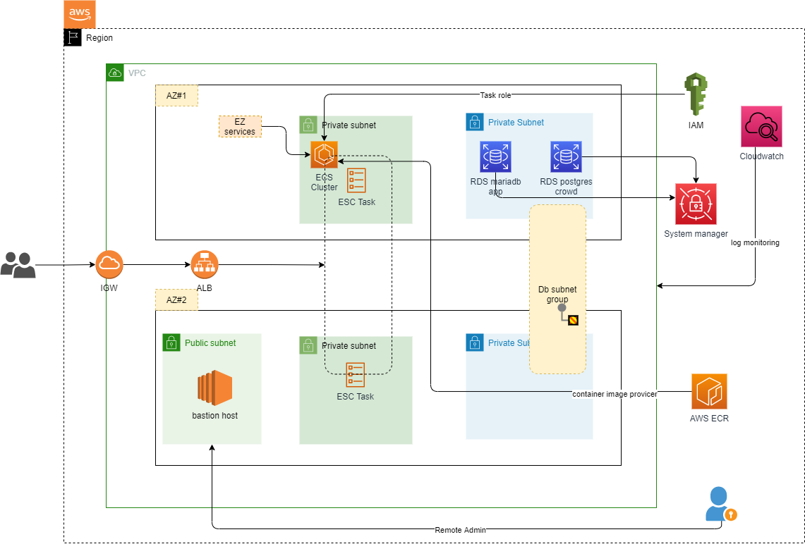

# Architecture
Time Estimate: 15 - 20 minutes  




***#IMPORTANT#***

* For the, backend to store the state of iac, please change it (located in backend.tf)
* The data inside variable name: ``image_url`` (located in variable.tf) is for dev env only

#PROJECT STRUCT# 
```
-modules 
|---bastion 
|---ecr 
|---ecs-fargate
|---netwrok
|---rds
|---data.tf
|---main.tf
|---output.tf
|---variables.tf
-backend.tf
-data.tf
-main.tf
-outputs.tf
-provider.tf
-variable.tf
```